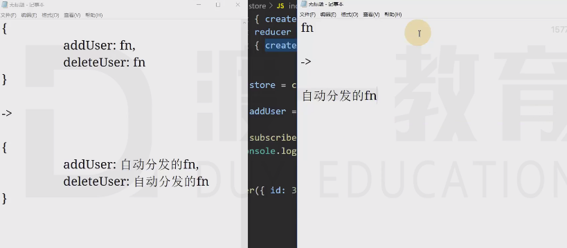

# redux源码 
## createStore

返回一个对象：

- `dispatch`：分发一个action
- `getState`：得到仓库中当前的状态
- `subscribe`：注册一个监听器，监听器是一个无参函数，该分发一个action之后，会运行注册的监听器。该函数会返回一个函数，用于取消监听


```js
/**
 * 判断某个对象是否是一个plain-object
 * @param {*} obj 
 */
function isPlainObject(obj) {
    if (typeof obj !== "object") {
        return false;
    }
    return Object.getPrototypeOf(obj) === Object.prototype;
}

/**
 * 得到一个指定长度的随机字符串
 * @param {*} length 
 */
function getRandomString(length) {
    return Math.random().toString(36).substr(2, length).split("").join(".")
}

/**
 * 实现createStore的功能
 * @param {function} reducer reducer
 * @param {any} defaultState 默认的状态值
 */
export default function (reducer, defaultState) {

    let currentReducer = reducer, //当前使用的reducer
        currentState = defaultState; //当前仓库中的状态

    const listeners = [];  //记录所有的监听器（订阅者）

    function dispatch(action) {
        //验证action
        if (!isPlainObject(action)) {
            throw new TypeError("action must be a plain object");
        }
        //验证action的type属性是否存在
        if (action.type === undefined) {
            throw new TypeError("action must has a property of type");
        }
        currentState = currentReducer(currentState, action)

        //运行所有的订阅者（监听器）
        for (const listener of listeners) {
            listener();
        }
    }

    function getState() {
        return currentState;
    }

    /**
     * 添加一个监听器（订阅器）
     */
    function subscribe(listener) {
        listeners.push(listener); //将监听器加入到数组中
        let isRemove = false;//是否已经移除掉了
        return function () {
            if (isRemove) {
                return;
            }
            //将listener从数组中移除
            const index = listeners.indexOf(listener);
            listeners.splice(index, 1);
            isRemove = true;
        }
    }

    //创建仓库时，需要分发一次初始的action
    dispatch({
        type: `@@redux/INIT${getRandomString(7)}`
    })

    return {
        dispatch,
        getState,
        subscribe
    }
}
```


## bindActionCreators

[react-learn/src/redux/bindActionCreators.js · DEV-Edu/frontend-react - 码云 - 开源中国 (gitee.com)](https://gitee.com/dev-edu/frontend-react/blob/7-7.手写bindActionCreators/react-learn/src/redux/bindActionCreators.js#)





##  combineReducers

组装reducers，返回一个reducer，数据使用一个对象表示，对象的属性名与传递的参数对象保持一致。

[react-learn/src/redux/combineReducers.js · DEV-Edu/frontend-react - 码云 - 开源中国 (gitee.com)](https://gitee.com/dev-edu/frontend-react/blob/7-8.手写combineReducers/react-learn/src/redux/combineReducers.js#)

