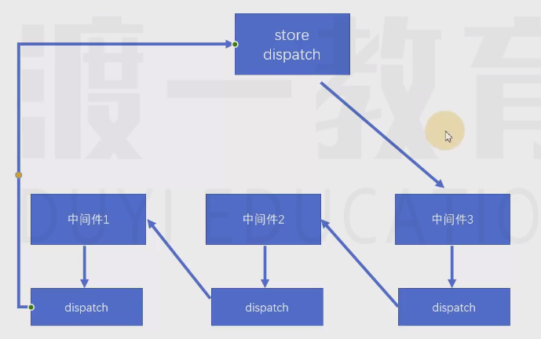

# Redux中间件（Middleware）

中间件：类似于插件，可以在不影响原本功能、并且不改动原本代码的基础上，对其功能进行增强。在Redux中，中间件主要用于`增强dispatch`函数。


## 核心原理

实现Redux中间件的基本原理，是`更改仓库中的dispatch`函数。洋葱模型。


## Redux中间件书写

-  中间件本身是一个函数，该函数接收一个`store`参数，表示创建的仓库，该仓库并非一个完整的仓库对象，仅包含`getState，dispatch`。该函数运行的时间，是在仓库创建之后运行。 

-  - 由于创建仓库后需要自动运行设置的中间件函数，因此，需要在创建仓库时，`告诉仓库有哪些中间件`
  - 需要调用`applyMiddleware`函数，将函数的返回结果作为`createStore`的第二或第三个参数。


```js
//应用中间件，方式1：
const store = createStore(reducer, applyMiddleware(logger1, logger2));
```


-  中间件函数必须返回一个`dispatch创建函数` 

```js

// /**
//  * 一个中间件函数
//  * @param {*} store 
//  */
// function logger1(store) {
//     return function (next) {
//         //下面返回的函数，是最终要应用的dispatch
//         return function (action) {
//             console.log("中间件1")
//             console.log("旧数据", store.getState());
//             console.log("action", action);
//             next(action);
//             console.log("新数据", store.getState());
//             console.log("")
//         }
//     }
// }

// function logger2(store) {
//     return function (next) {
//         //下面返回的函数，是最终要应用的dispatch
//         return function (action) {
//             console.log("中间件2")
//             console.log("旧数据", store.getState());
//             console.log("action", action);
//             next(action);
//             console.log("新数据", store.getState());
//             console.log("")
//         }
//     }
// }

const logger1 = store => next => action => {
    console.log("中间件1")
    console.log("旧数据", store.getState());
    console.log("action", action);
    next(action);
    console.log("新数据", store.getState());
    console.log("")
}

const logger2 = store => next => action => {
    console.log("中间件2")
    console.log("旧数据", store.getState());
    console.log("action", action);
    next(action);
    console.log("新数据", store.getState());
    console.log("")
}


```




-  `applyMiddleware`函数，它会`返回一个函数 `，用于`记录有哪些中间件`

- - 然后`又返回一个函数`，该函数用于`记录创建仓库`的方法

```js
//应用中间件，方式1（最终调用的是方式2）：
// const store = createStore(reducer, applyMiddleware(logger1, logger2));

//方式2：
const store = applyMiddleware(logger1, logger2)(createStore)(reducer)
```

 