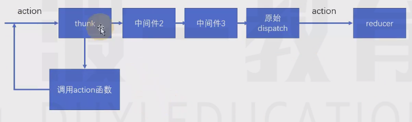
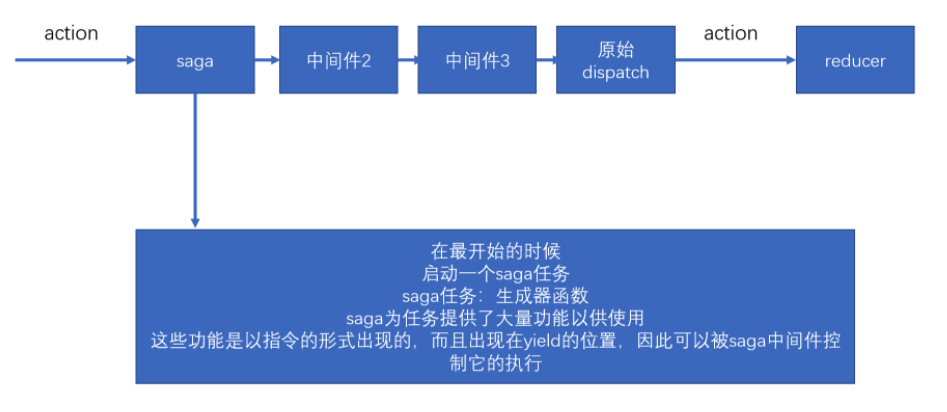

# redux-logger

[react-learn/src/store/index.js · DEV-Edu/frontend-react - 码云 - 开源中国 (gitee.com)](https://gitee.com/dev-edu/frontend-react/blob/8-1.redux-logger/react-learn/src/store/index.js)


注意：

有多个中间件时，` logger` 要放在最后一个。


# 利用中间件进行副作用处理

## redux-thunk

> thunk允许`action`是一个带有副作用的`函数`，当action是一个函数被分发时，thunk会阻止action继续向后移交。




1. 如果action 是一个函数，则thunk 不会向后移交，会直接`调用函数`；
2. 调用函数 中，会`dispatch（store.dispatch)`  action ，此时 action 不是函数，重新执行thunk 向后移交action。


thunk会向函数中传递三个参数：
- `dispatch`：来自于store.dispatch
- `getState`：来自于store.getState
- `extra`：来自于用户设置的额外参数

[react-learn/src/store/test.js · DEV-Edu/frontend-react - 码云 - 开源中国 (gitee.com)](https://gitee.com/dev-edu/frontend-react/blob/8-2.redux-thunk/react-learn/src/store/test.js)


**手写`thunk`：**

[react-learn/src/redux-thunk/index.js · DEV-Edu/frontend-react - 码云 - 开源中国 (gitee.com)](https://gitee.com/dev-edu/frontend-react/blob/8-3.手写thunk/react-learn/src/redux-thunk/index.js)


案例：管理学生数据

[笔记.md · DEV-Edu/frontend-react - 码云 - 开源中国 (gitee.com)](https://gitee.com/dev-edu/frontend-react/blob/8-4.案例.管理学生数据/笔记.md)


**注意：**

thunk 必须是第一个中间件。


## redux-promise

如果action是一个promise，则会等待promise完成，将完成的结果作为action触发，如果action不是一个promise，则判断其payload是否是一个promise，如果是，等待promise完成，然后将得到的结果作为payload的值触发。


[react-learn/src/store/action/student/searchResult.js · DEV-Edu/frontend-react - Gitee.com](https://gitee.com/dev-edu/frontend-react/blob/8-5.redux-promise/react-learn/src/store/action/student/searchResult.js)


## redux-saga

> 中文文档地址：https://redux-saga-in-chinese.js.org/

- 纯净
- 强大
- 灵活




在saga任务中，如果yield了一个普通数据，saga不作任何处理，仅仅将数据传递给yield表达式（把得到的数据放到next的参数中），因此，在saga中，yield一个普通数据没什么意义。


saga需要你在`yield后面`放上一些合适的`saga指令（saga effects）`，如果放的是指令，saga中间件会根据不同的指令进行特殊处理，以控制整个任务的流程。

每个指令本质上就是一个`函数`，该函数调用后，会返回一个指令对象，saga会接收到该指令对象，进行各种处理。

**一旦saga任务完成（生成器函数运行完成），则saga中间件一定结束**。

**指令前面必须使用yield，以确保该指令的返回结果被saga控制**。

 

- `take指令`：`【阻塞】监听某个action`，如果action发生了，则会进行下一步处理，take指令仅监听一次。yield得到的是完整的action对象

```js
import { take } from "redux-saga/effects"
import { actionTypes } from '../action/counter'

/**
* saga任务
*/
export default function* () {
  //  一旦saga任务完成（生成器函数运行完成），则saga中间件一定结束。
  //  持续监听：加上死循环。
    while (true) {
        const action = yield take(actionTypes.asyncIncrease);
        console.log("发生了异步的increase", action);
    }
}

```


- `all指令`：`【阻塞】该函数传入一个数组`，数组中放入生成器，saga会等待所有的生成器全部完成后才会进一步处理

```js
import { all } from "redux-saga/effects"
import counterTask from "./counterTask"
import studentTask from "./studentTask"
/**
* saga任务
*/
export default function* () {
    yield all([counterTask(), studentTask()])
    console.log("saga 完成")
}

```


- `takeEvery指令`：`不断的监听某个action`，当某个action到达之后，运行一个函数。`takeEvery永远不会结束当前的生成器`

```js
import { takeEvery } from "redux-saga/effects"
import { actionTypes } from "../action/counter"

function* asyncIncrease() {
    console.log("触发了asyncIncrease")
}

function* asyncDecrease() {
    console.log("触发了asyncDecrease")
}

export default function* () {
    yield takeEvery(actionTypes.asyncIncrease, asyncIncrease)
    yield takeEvery(actionTypes.asyncDecrease, asyncDecrease)
    console.log("正在监听asyncIncrease、asyncDecrease")
}
```

[react-learn/src/store/saga · DEV-Edu/frontend-react - 码云 - 开源中国 (gitee.com)](https://gitee.com/dev-edu/frontend-react/tree/8-8.saga基础/react-learn/src/store/saga)


- delay指令：`【阻塞】阻塞指定的毫秒数`（延迟多少毫秒）

```js
yield delay(2000)
```


- put指令：用于`重新触发action`，相当于`dispatch一个action`

```js
import { takeEvery, delay, put } from "redux-saga/effects"
import { actionTypes, increase, decrease } from "../action/counter"

function* asyncIncrease() {
    yield delay(2000);
    yield put(increase())
}

function* asyncDecrease() {
    yield delay(2000);
    yield put(decrease())
}

export default function* () {
    yield takeEvery(actionTypes.asyncIncrease, asyncIncrease)
    yield takeEvery(actionTypes.asyncDecrease, asyncDecrease)
    console.log("正在监听asyncIncrease、asyncDecrease")
}
```


- call指令：【可能阻塞（是Promise时阻塞）】用于`副作用（通常是异步）函数调用`

> 不使用指令（不建议）：
>
> [react-learn/src/store/saga/studentTask copy 2.js · DEV-Edu/frontend-react - Gitee.com](https://gitee.com/dev-edu/frontend-react/blob/8-9.saga指令1/react-learn/src/store/saga/studentTask copy 2.js)
>
> [react-learn/src/store/saga/studentTask copy.js · DEV-Edu/frontend-react - Gitee.com](https://gitee.com/dev-edu/frontend-react/blob/8-9.saga指令1/react-learn/src/store/saga/studentTask copy.js)
>
> 
>
> 使用指令：

```js
function* fetchStudents() {
    //设置为正在加载中
    yield put(setIsLoading(true))
    const condition = yield select(state => state.students.condition);
    //使用call指令，按照当前仓库中的条件
    const resp = yield call(mockStudents, condition)
    yield put(setStudentsAndTotal(resp.datas, resp.cont))
    yield put(setIsLoading(false));
}

```


```js
// 绑定this，使用数组，第一个参数 就是this
const resp = yield call(['abc', mockStudents] , condition)

// 绑定this，使用对象，context 
const resp = yield call({
  context: 'abc',
  fn: mockStudents
})
```


- apply指令：【可能阻塞】用于副作用（通常是异步）函数调用

- select指令：用于得到`当前仓库中的数据`

```js
function* fetchStudents() {
  // 对数据进行筛选
    const condition = yield select(state => state.students.condition);
}
```


- cps指令：【可能阻塞】用于调用那些传统的回调方式的异步函数

 [react-learn/src/store/saga/studentTask.js · DEV-Edu/frontend-react - 码云 - 开源中国 (gitee.com)](https://gitee.com/dev-edu/frontend-react/blob/8-9.saga指令1/react-learn/src/store/saga/studentTask.js)


- fork：用于`开启一个新的任务`，该任务不会阻塞，该函数需要传递一个生成器函数，fork返回了一个对象，类型为`Task`

 

- `cancel`：用于取消一个或多个任务，实际上，取消的实现原理，是利用generator.return。cancel可以不传递参数，如果不传递参数，则取消当前任务线。


- `takeLastest`：功能和takeEvery一致，只不过，会自动取消掉之前开启的任务


- `cancelled`：判断当前任务线是否被取消掉了


- `race`：【阻塞】竞赛，可以传递多个指令，当其中任何一个指令结束后，会直接结束，与Promise.race类似。返回的结果，是最先完成的指令结果。并且，该函数会自动取消其他的任务

[DEV-Edu/frontend-react - 码云 - 开源中国 (gitee.com)](https://gitee.com/dev-edu/frontend-react/tree/8-10.saga指令2)


