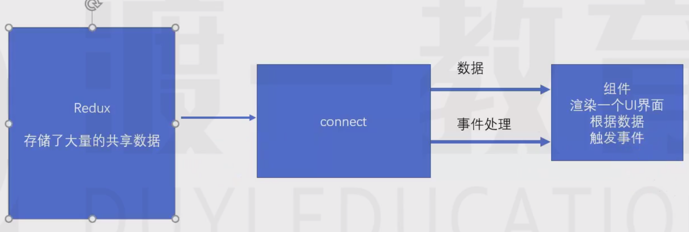

# react-redux（官方）

- `React`: 组件化的UI界面处理方案
- `React-Router`: 根据地址匹配路由，最终渲染不同的组件
- `Redux`：处理数据以及数据变化的方案（主要用于处理共享数据）


> 如果一个组件，仅用于`渲染一个UI界面`，而没有状态（通常是一个函数组件），该组件叫做**展示组件**。
>
> 
>
> 如果一个组件，仅用于提供数据，没有任何属于自己的UI界面，则该组件叫做**容器组件**，容器组件纯粹是为了给其他组件`提供数据`。


**react-redux库：链接redux和react**

- `Provider组件`：没有任何UI界面，该组件的作用，是将`redux的仓库放到一个上下文中`。

```js
// App.js
import React from 'react'
import { Provider } from "react-redux"
import store from "./store"
import Counter from "./components/Counter"

export default function App() {
    return (
        <Provider store={store}>
            <Counter abc={123}/>
        </Provider>
    )
}

```


手写 连接组件和store。

[react-learn/src/components/Counter copy.js · DEV-Edu/frontend-react - 码云 - 开源中国 (gitee.com)](https://gitee.com/dev-edu/frontend-react/blob/9-1.react-redux/react-learn/src/components/Counter copy.js#)


- `connect`：`高阶组件，用于链接仓库和组件的`

  - 细节一：

    ​	如果`对返回的容器组件加上额外的属性`，则这些属性会`直接传递到展示组件`

    ​	如果`对返回的容器组件加上ref`，则会进行`ref 转发到展示组件`。

  ```js
  import React from 'react'
  import { Provider } from "react-redux"
  import store from "./store"
  import Counter from "./components/Counter"
  
  export default function App() {
      return (
          <Provider store={store}>
              <Counter abc={123}/>
          </Provider>
      )
  }
  
  ```

  

  

  - 第一个参数：`mapStateToProps`: 
    - 参数1：整个仓库的状态
    - 参数2：使用者传递的属性对象
  - 第二个参数：
    - 情况1：传递一个函数 `mapDispatchToProps`
      - 参数1：dispatch函数
      - 参数2：使用者传递的属性对象
      - 函数返回的对象会作为属性传递到展示组件中（作为事件处理函数存在）

    [react-learn/src/components/Counter copy 2.js · DEV-Edu/frontend-react - 码云 - 开源中国 (gitee.com)](https://gitee.com/dev-edu/frontend-react/blob/9-1.react-redux/react-learn/src/components/Counter copy 2.js)

    

    - 情况2：传递一个对象，对象的每个属性是一个action创建函数，当事件触发时，会自动的dispatch函数返回的action

  [react-learn/src/components/Counter.js · DEV-Edu/frontend-react - 码云 - 开源中国 (gitee.com)](https://gitee.com/dev-edu/frontend-react/blob/9-1.react-redux/react-learn/src/components/Counter.js)

  

  - 细节二：如果不传递第二个参数，通过connect连接的组件，`会自动得到一个属性：dispatch`，使得组件有能力自行触发action，但是，不推荐这样做。

  




# 案例

[react-learn/src · DEV-Edu/frontend-react - 码云 - 开源中国 (gitee.com)](https://gitee.com/dev-edu/frontend-react/tree/9-2.demo.学生查询/react-learn/src)


# react-redux 其他api

> 详情参考：https://react-redux.js.org/api

## connect

- mergeProps: 一个函数
  - 参数1：stateProps，该参数的值来自于mapStateToProps返回的值
  - 参数2：dispatchProps，该参数的值来自于mapDispatchToProps返回的值
  - 参数3：ownProps，来自于组件使用者传递的属性
  - 返回值：一个对象，该对象的属性最终会被传递到包装的组件中。
- options：配置对象


## connectAdvanced

该函数和connect一样，也是用于连接React组件和Redux仓库的，只不过它的配置比connect少一些

该函数需要传递两个参数：

- selectorFactory
  - 参数1：dispatch
  - 参数2：factoryOptions，配置
  - 返回：函数
    - 参数1：state
    - 参数2：ownProps
    - 返回的是一个对象：该对象的属性最终，会成为包装的组件的属性


- connectOptions


## createProvider

createProvider(字符串key)：通过一个唯一的key值创建一个Provider组件。

```js
var Provider1 = createProvider("p1");
var Provider2 = createProvider("p2");
```

