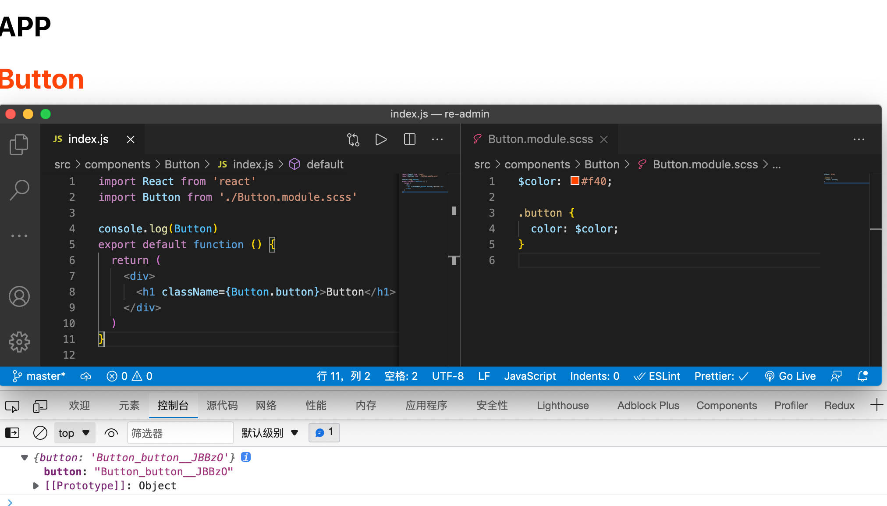
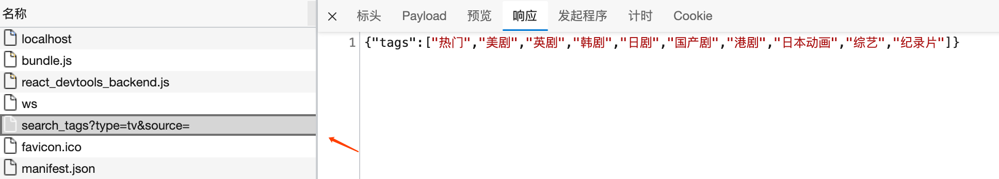
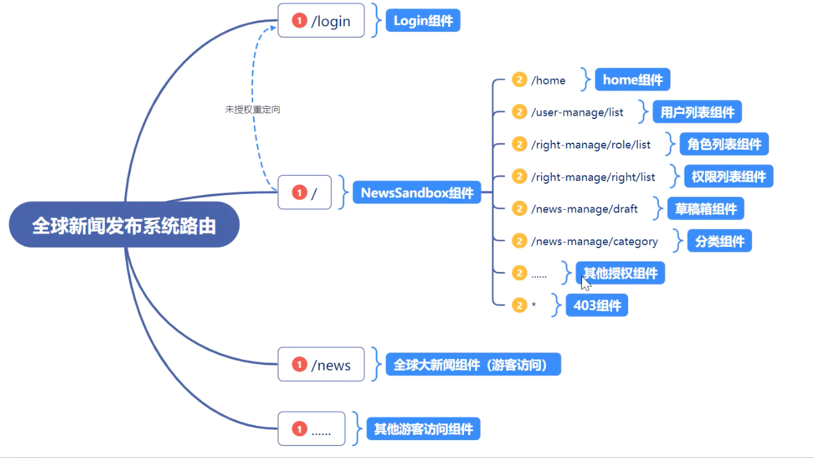
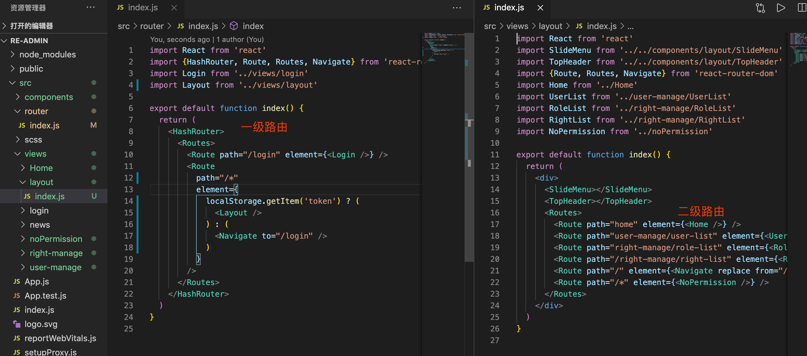

# 项目初始化 
# 安装

[https://create-react-app.dev/docs/getting-started](https://create-react-app.dev/docs/getting-started)

- 安装指定版本

```shell
npm install react@17.x react-dom@17.x --save
```

- sass

```shell
npm install node-sass
```

# Css模块化

对标签选择器没有作用，对 **类、id 选择器 **有作用。

[https://create-react-app.dev/docs/adding-a-css-modules-stylesheet](https://create-react-app.dev/docs/adding-a-css-modules-stylesheet)

- Button.module.scss




# 反向代理

[https://create-react-app.dev/docs/proxying-api-requests-in-development#configuring-the-proxy-manually](https://create-react-app.dev/docs/proxying-api-requests-in-development#configuring-the-proxy-manually)

```shell
npm install http-proxy-middleware --save
npm install axios --save
```

- 新建 setupProxy.js

```js
const {createProxyMiddleware} = require('http-proxy-middleware')

module.exports = function (app) {
  app.use(
    '/j',
    createProxyMiddleware({
      target: 'https://movie.douban.com/',
      changeOrigin: true
    })
  )
}

```


- App.js

```jsx

import './scss/App.scss'
import Button from './components/Button'
import axios from 'axios'
import {useEffect} from 'react'

function App() {
  useEffect(() => {
    axios.get('/j/search_tags?type=tv&source=').then((res) => {
      console.log('douban', res)
    })
  }, [])
  return (

    <div className="App">
      <h1>APP</h1>
      <Button></Button>
    </div>

  )
}

export default App

```




# 路由架构

## 架构



- 安装

```shell
npm install react-router-dom@6
```


## 语法更新

- HashRouter里面包Switch会出错，请改为包Routes(Routes 和 Switch 的功用是一样的，都能做到精准匹配)

- Route的 component 属性改为element，并且 element 中请使用<>包裹组件名称

- 所以我们需要将 Redirect 改为 Navigate，并且一样使用的是 element 而不是 render


**模拟路由拦截：**

- 注意

> Navigate 只能包裹在 Route 中，Routes 中只能有 Route 或者 Fragment。

    import React from 'react'
    import {HashRouter, Route, Routes, Navigate} from 'react-router-dom'
    import Login from '../views/login'
    import News from '../views/news'
    
    export default function index() {
      return (
        <HashRouter>
          <Routes>
            <Route path="/login" element={<Login />} />
            <Route
              path="/news"
              element={
                localStorage.getItem('token') ? <News /> : <Navigate to="/login" />
              }
            />
          </Routes>
        </HashRouter>
      )
    }

[http://localhost:3000/#/news](http://localhost:3000/#/news)


## 搭建二级路由



- 二级路由


```jsx
- import React from 'react'
import SlideMenu from '../../components/layout/SlideMenu'
import TopHeader from '../../components/layout/TopHeader'
import {Route, Routes, Navigate} from 'react-router-dom'
import Home from '../Home'
import UserList from '../user-manage/UserList'
import RoleList from '../right-manage/RoleList'
import RightList from '../right-manage/RightList'
import NoPermission from '../noPermission'


export default function index() { return (

<Route path="/" element={} /> <Route path="/home" element={} /> <Route path="/user-manage/user-list" element={} /> <Route path="/right-manage/role-list" element={} /> <Route path="/right-manage/right-list" element={} /> <Route path="/*" element={} />
) }

```


[http://localhost:3000/#/user-manage/user-list](http://localhost:3000/#/user-manage/user-list)

[http://localhost:3000/#/right-manage/role-list](http://localhost:3000/#/right-manage/role-list)