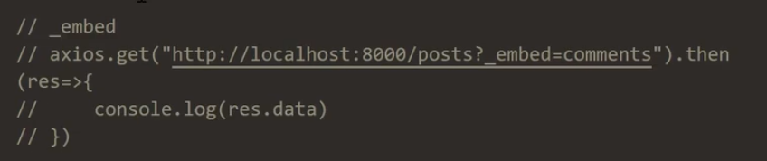
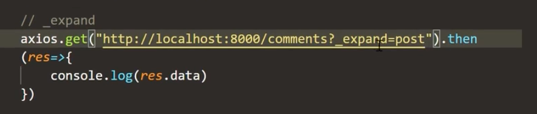
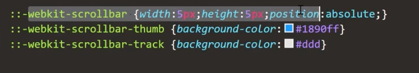

# Layout 布局 
# 动态SlideMenu

## menu

### antd3.x 

```js
  let navigate = useNavigate();
  // Menu
  const renderMenu = (menuList) => {
    return menuList.map((item) => {
      if (item.children) {
        return (
          <SubMenu key={item.key} icon={item.icon} title={item.title}>
            {renderMenu(item.children)}
          </SubMenu>
        );
      }
      return (
        <Menu.Item
          key={item.key}
          icon={item.icon}
          onClick={() => navigate(item.key)}
        >
          {item.title}
        </Menu.Item>
      );
    });
  };
```

### antd4.x

只有menu 组件，传入**items**。

icon 要写成组件的形式。

```js
  {
    key: '/home',
    title: '首页',
    icon: <HomeOutlined />
  },
```

## 使用router

### v5

withRouter	高阶组件 传入router。

原理：高阶组件中的withRouter, 作用是将一个组件包裹进Route里面, 然后react-router的三个对象history, location, match就会被放进这个组件的props属性中.如果我们某个东西不是一个Router, 但是我们要依靠它去跳转一个页面, 比如点击页面的logo, 返回首页, 这时候就可以使用withRouter来做.

```js
import { withRouter } from 'react-router-dom';


export default withRouter(comp)
```


### v6

改用 useNavigate 会更方便。

```js
import {useNavigate} from 'react-router'

let navigate = useNavigate();
navigate('/home')
```

## JsonServer

0 编码实现REST API。

```js
npm i -g json-server

json-server --watch -p 5000 db.json 
```

**操作：**

- get

- post 增

- put  替换式更新

会把原纪录删掉。

- patch 补丁式更新

- delete 删除

**高级操作：**

- 向下关联



- 向上查找



### 获取接口

    http://localhost:5000/rights?_embed=children
    
    {
        "id": 2,
        "title": "用户管理",
        "key": "/user-manage",
        "pagepermisson": 1,	// 是否可以访问
        "grade": 1,
        "children": [
            {
                "id": 3,
                "title": "添加用户",
                "rightId": 2,
                "key": "/user-manage/add",
                "grade": 2
            }
        ]
    }

- 生成 **Menu** 组件所需数据格式


```js

```


- 设置滚动条



## menu 和路由状态保持一致

### v5

使用withRouter  传入的 props，  props.location.pathname

### v6

`props.location.pathname` 可以用 **useLocation** 钩子取代，与 props.location 是一样的用法：

```js
  import { useNavigate, useLocation } from "react-router";
  
  
           const location = useLocation()
      const defaultSelectedKeys = [location.pathname]
      const defaultOpenKeys = ['/' + location.pathname.split('/')[1]]
      
   <Menu
        theme="dark"
        defaultSelectedKeys={defaultSelectedKeys}
        defaultOpenKeys={defaultOpenKeys}
        mode="inline"
        onClick={handleMenuClick}
        items={menuList}
      />
```

