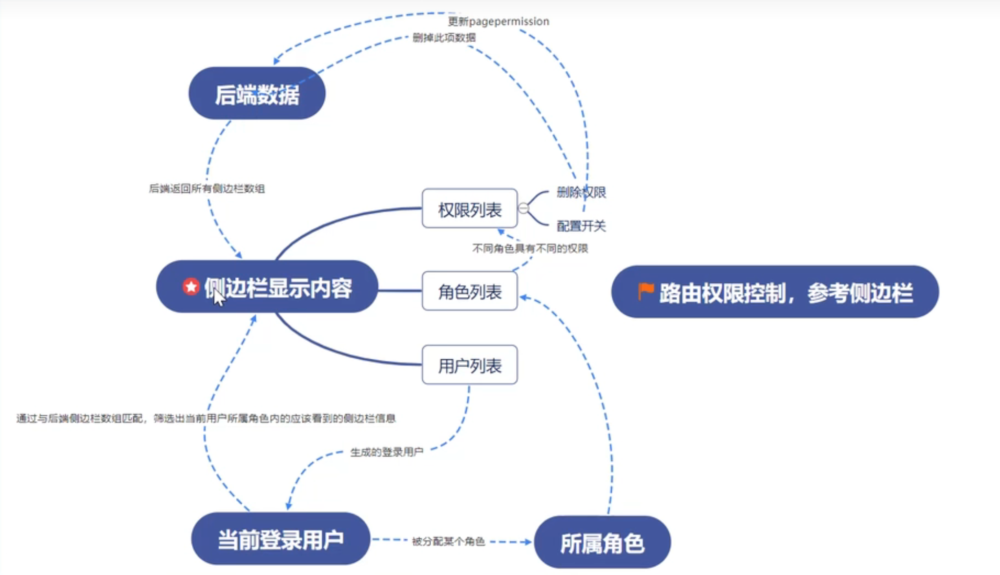
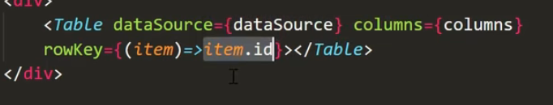
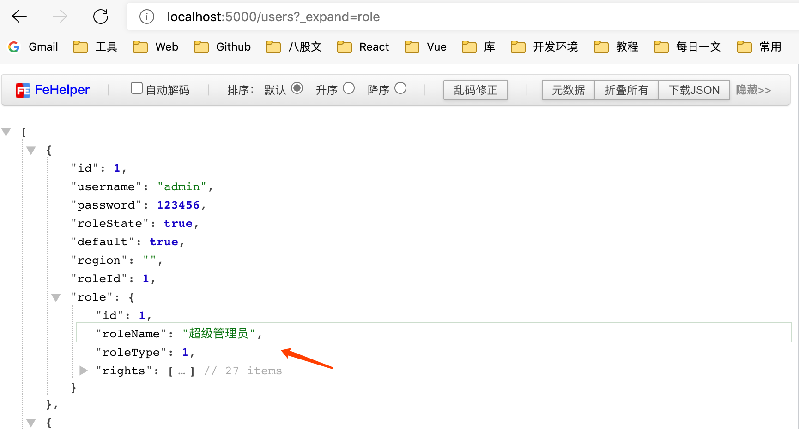
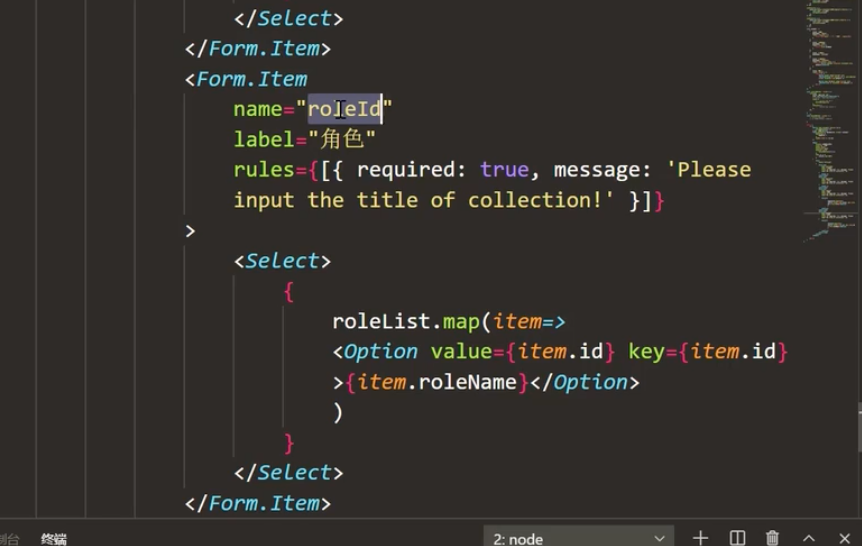
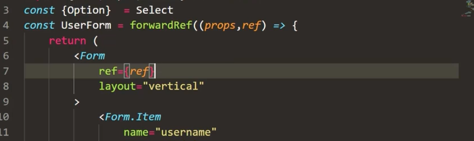
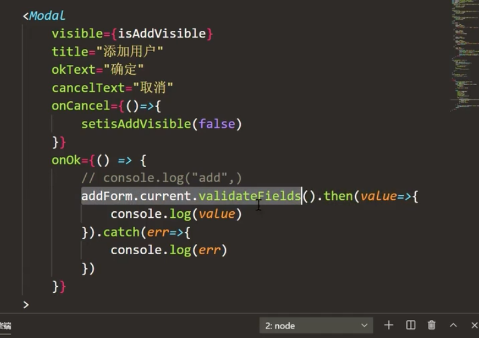
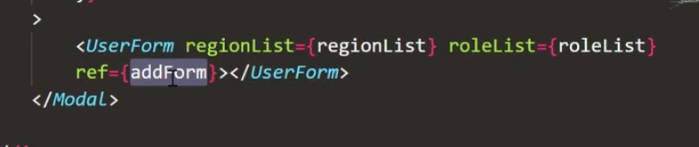

# 权限控制 
# 权限列表



## Table

```js
const columns = [
  {
    title: 'ID',
    dataIndex: 'id',
    key: 'id',
    render(id) {
      return <strong>{id}</strong>
    }
  },
  {
    title: '权限名称',
    dataIndex: 'title',
    key: 'title'
  },
  {
    title: '权限路径',
    dataIndex: 'key',
    key: 'key',
    render(key) {
      return <Tag color="gold">{key}</Tag>
    }
  },
  {
    title: '操作',
    key: 'action',
    render() {
      return (
        <div>
          <Button
            type="primary"
            danger
            ghost
            shape="circle"
            icon={<DeleteFilled />}
            style={{marginRight: '10px'}}
          />
          <Button type="primary" ghost shape="circle" icon={<EditFilled />} />
        </div>
      )
    }
  }
]
```

## 删除

```js
// 删除一级权限
export const deleteRightId = (id) => axios.delete(`/rights/${id}`)
// 删除二级权限
export const deleteChildrenId = (id) => axios.delete(`/children/${id}`)
```


## 配置

```js
// 配置一级权限
export const patchRightId = (id, params) => axios.patch(`/rights/${id}`, params)
// 配置二级权限
export const patchChildrenId = (id, params) =>
  axios.patch(`/children/${id}`, params)
```

# 角色列表

## Table 改变传入的key 属性



## 树形控件

            <Tree
              checkable
              treeData={treeData}
              defaultCheckedKeys={currentRights}
              onCheck={onCheck}
            />

# 用户列表

## 获取用户列表

    // 获取用户列表
    export const getUserList = () => axios.get(`users?_expand=role`)






## 表单

### v3

- forwardRef

把父组件的 **ref** 对象，透传到 子组件的ref上，父组件拿到 子组件的对象。

子组件



父组件





### v4

使用封装好的antd组件。

## 编辑

- forwardRef

把父组件的 **ref** 对象，透传到 子组件的ref上，父组件拿到 子组件的对象。

子组件

    import React, {useState, forwardRef} from 'react'
    
    export default forwardRef(UserForm)

父组件

```js
import React, {useEffect, useState, useRef} from 'react'

  const formRef = useRef(null)
  
              <UserForm
            title={'更新'}
            ref={formRef}
            visible={isModalVisible}
            onCreate={handleFormUpdate}
            roleList={roleList}
            regionList={regionList}
            onCancel={() => {
              setIsModalVisible(false)
            }}
          />


```

