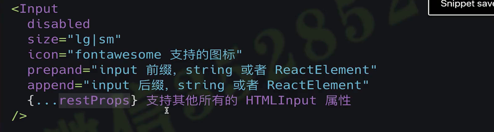
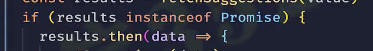

# Input 

## TS Omit 忽略属性

    export interface InputProps extends Omit<InputHTMLAttributes<HTMLElement>, 'size' > {
      /**是否禁用 Input */
      disabled?: boolean;
      /**设置 input 大小，支持 lg 或者是 sm */
      size?: InputSize;
      /**添加图标，在右侧悬浮添加一个图标，用于提示 */
      icon?: IconProp;
      /**添加前缀 用于配置一些固定组合 */
      prepend?: string | ReactElement;
      /**添加后缀 用于配置一些固定组合 */
      append?: string | ReactElement;
      onChange? : (e: ChangeEvent<HTMLInputElement>) => void;
    }

# 判断Promise

