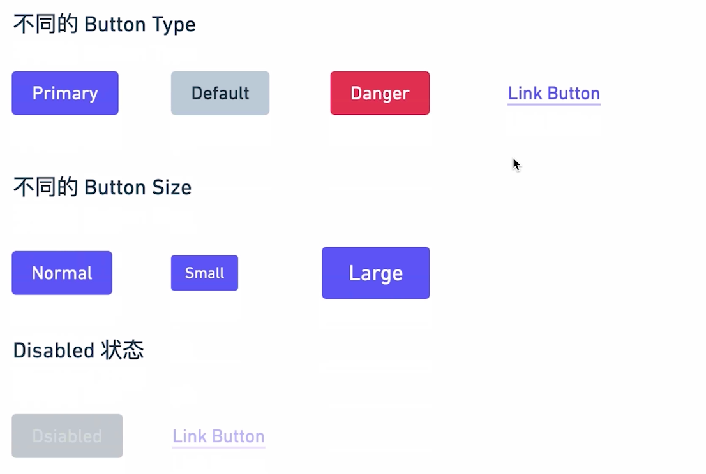
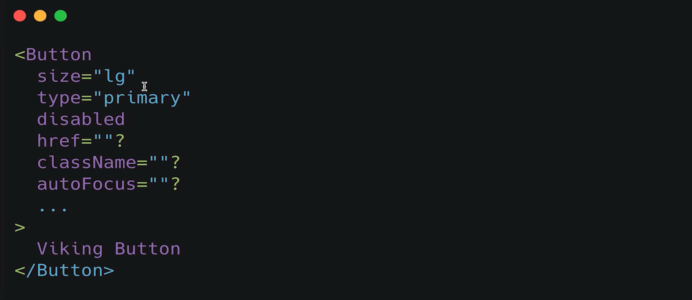
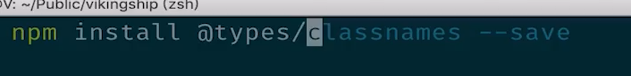

# button组件 
# 需求分析

- 类型

为Link 类型时，是 a 标签。

- 尺寸

- 状态

- 需支持button 原生的属性

# 使用

# 扩展

## classnames 

[https://github.com/JedWatson/classnames](https://github.com/JedWatson/classnames)

    npm install classnames --save
    npm install @types/classnames --save

## pointer-events

不接受鼠标事件。

## 添加 button、a 原生属性

- TS 叠加类型  **&**

**Partial**  把属性全部变成可选。

    type NativeButtonProps = BaseButtonProps & ButtonHTMLAttributes<HTMLElement>
    type AnchorButtonProps = BaseButtonProps & AnchorHTMLAttributes<HTMLElement>
    export type ButtonProps = Partial<NativeButtonProps & AnchorButtonProps>