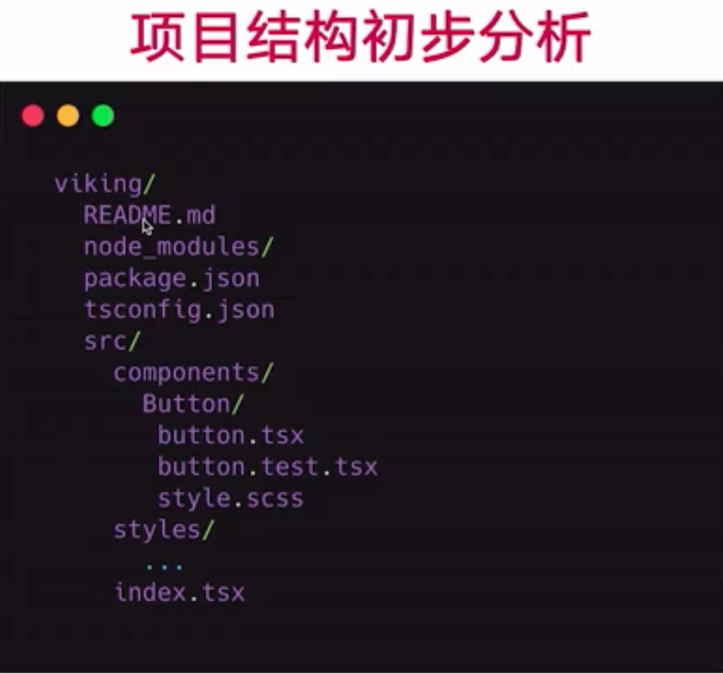
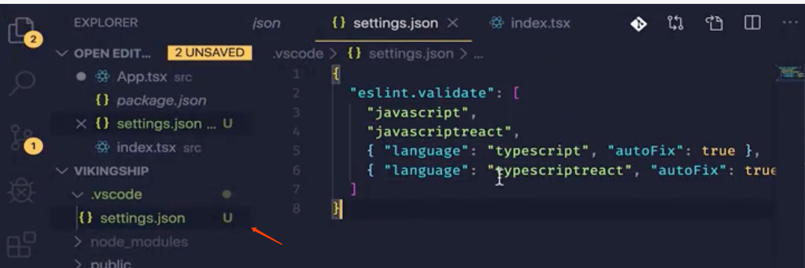
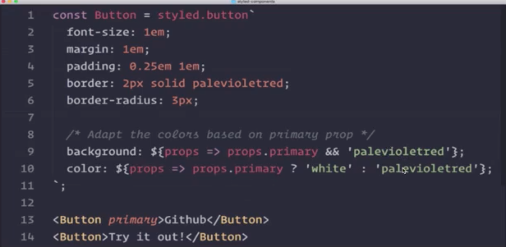
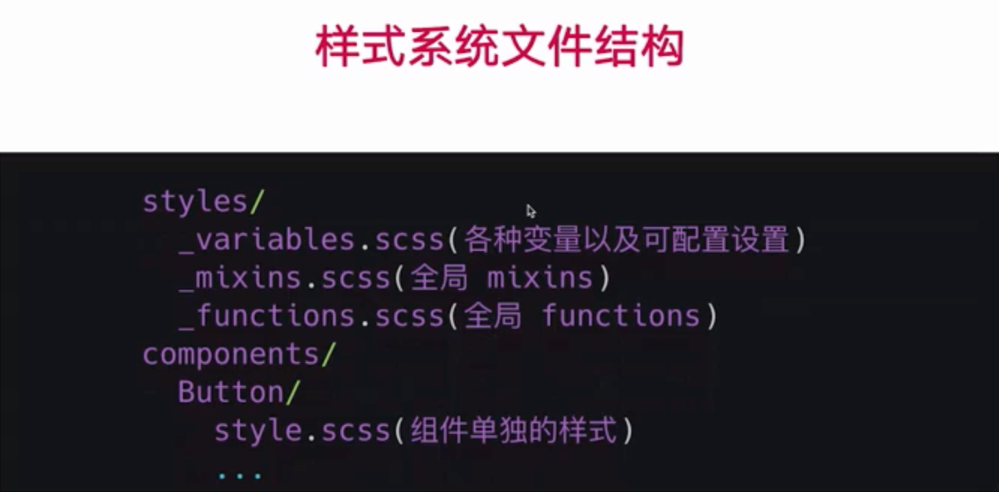
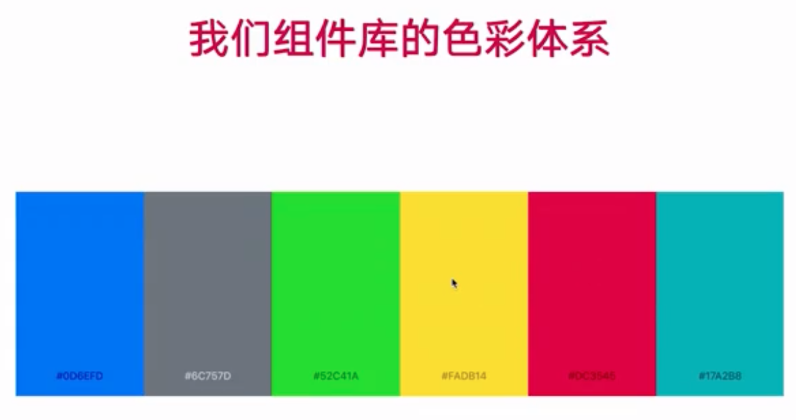
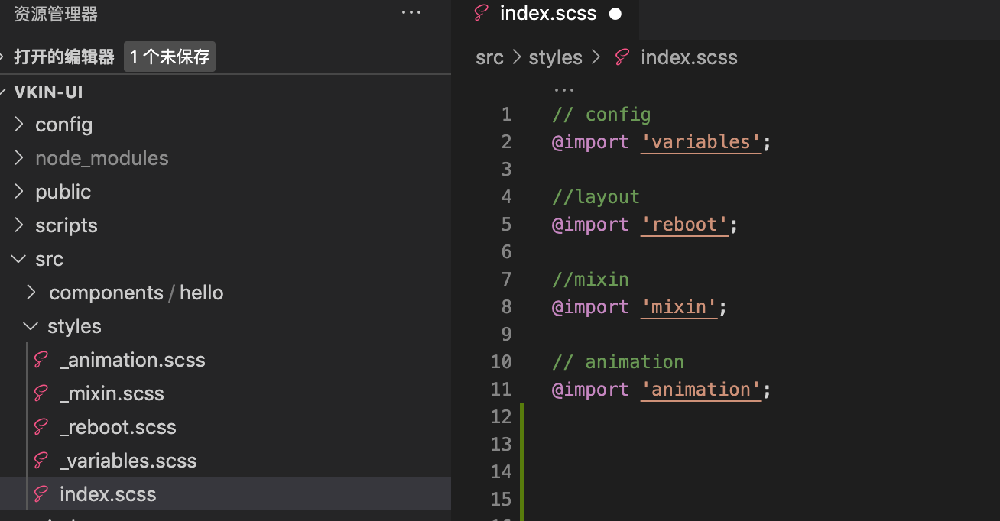

# 主题样式设计 
# 文件结构和代码规范

- 新建

.vscode/settings.json

# 样式解决方案

- Inline CSS 

- CSS in JS

- Styled Component

- SASS/LESS

# 样式系统文件结构

# 设计色彩体系

# **组件库样式变量分类**

- 基础色彩系统

- 字体系统

- 表单

- 按钮

- 边框和阴影

- 可配置开关

# 注意

`_`开头的SCSS 文件，只能被导入，不能被编译。

导入时 不加`_` 。

