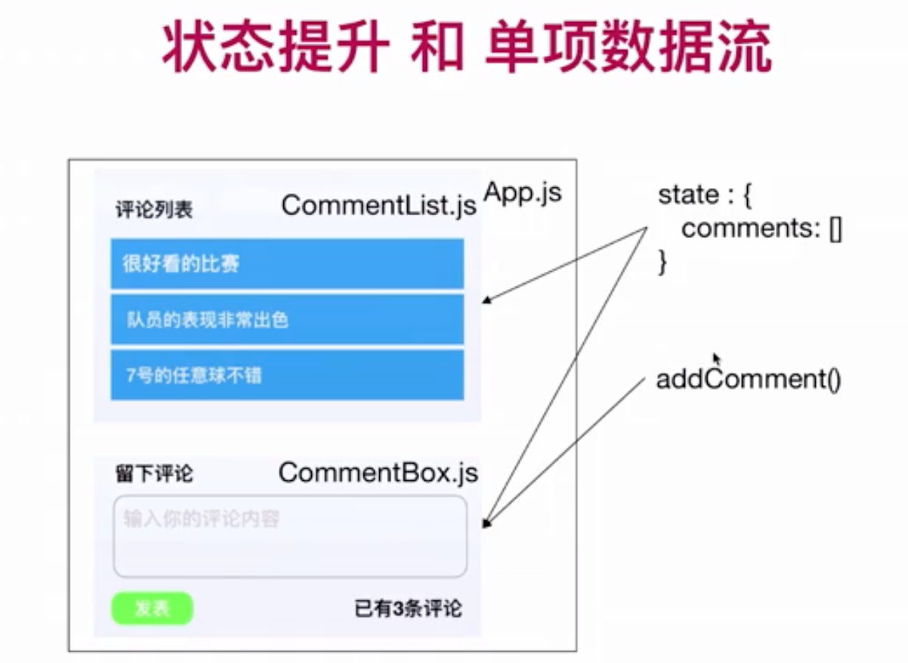

# 环境配置 
# 1 基础回顾

状态提升，将共享的状态提升至 他们最近的父组件上管理。

单向数据流。

# 2 配置开发环境

## Hello.vue

[https://github.com/PantherVkin/Vkin-UI/commit/94da712463b40af303ef7305692341481804407d](https://github.com/PantherVkin/Vkin-UI/commit/94da712463b40af303ef7305692341481804407d)

    import React from 'react'
    
    interface IHelloProps {
      message?: string
    }
    
    // const Hello: React.FunctionComponent<IHelloProps> = (props) => {
    //   return <h2>{props.message}</h2>
    // }
    
    // React.FunctionComponent 简写FC
    // const Hello: React.FC<IHelloProps> = (props) => {
    //   return <h2>{props.message}</h2>
    // }
    
    function Hello(props: IHelloProps) {
      return <h2>{props.message}</h2>
    }
    
    export default Hello