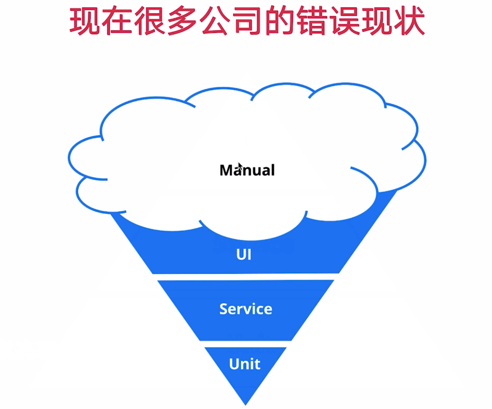

# 组件测试 
# 测试金字塔

# jest

[https://jestjs.io/](https://jestjs.io/)

# react 配置

react 默认已经安装。

- testing-library

[https://testing-library.com/docs/react-testing-library/intro/](https://testing-library.com/docs/react-testing-library/intro/)

- jest-dom

添加断言库（**新增断言**）。

[https://github.com/testing-library/jest-dom](https://github.com/testing-library/jest-dom)

## QA

- `src/setupTests.ts`

任意导入一个均可。

    import '@testing-library/jest-dom/extend-expect'
    import '@testing-library/jest-dom'

- **package.json**

        "setupFilesAfterEnv": [
          "<rootDir>/src/setupTests.ts"
        ],

    npm i -D --exact jest-watch-typeahead@0.6.5

## Button 测试用例

[https://github.com/PantherVkin/Vkin-UI/commit/853b821d5862d3f4eb57673a51e0114ed8343533](https://github.com/PantherVkin/Vkin-UI/commit/853b821d5862d3f4eb57673a51e0114ed8343533)