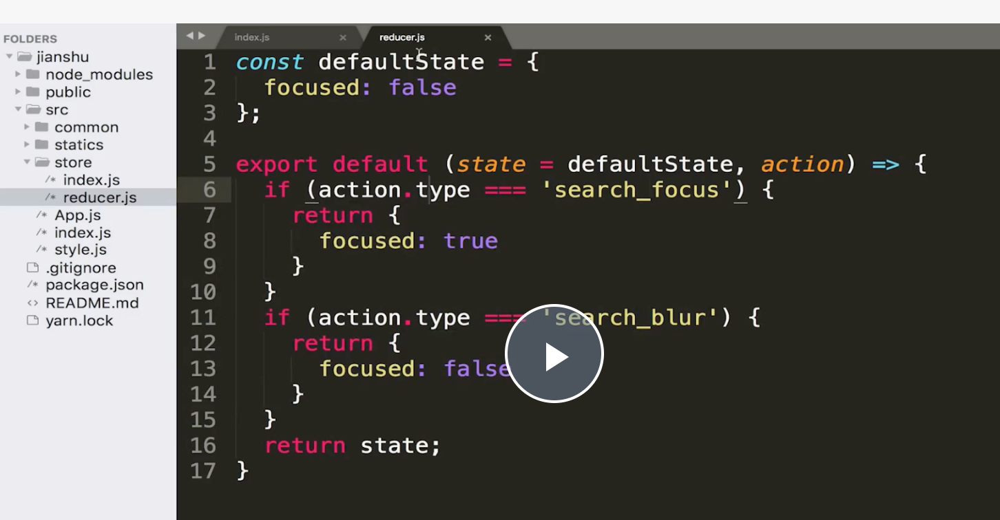

# props，state 与 render 函数的关系

props state 改变，会重新运行 `render`。

当父组件的render函数被运行时，他的子组件的render都将被重新运行。

# 生命周期

# redux

# UI 组件和容器组件

- UI 组件：`负责渲染`

- 容器组件：`负责逻辑`

# Redux 中发送异步请求获取数据

## 使用 Redux-thunk 中间件实现 ajax 数据请求

把异步操作放到 action 中。

- **使用 thunk**

- **使用了 thunk，aciton 可以返回函数**

处理异步代码。

- 组件使用 action ，并分发

## 中间件

action 和 store 中间。

## **Redux-saga**

- 使用 saga

- 组件使用

- 将异步的操作放到单独的文件管理。

## **React-redux**

# 3 项目

## Styled-Components 与 Reset.css 的结合使用

    npm install styled-components --save

[https://juejin.cn/post/6844903878580764686](https://juejin.cn/post/6844903878580764686)

[https://juejin.cn/post/6968034561791885319](https://juejin.cn/post/6968034561791885319)

- 定义全局样式

[https://www.jianshu.com/p/6e1711de4ec0](https://www.jianshu.com/p/6e1711de4ec0)

- JS 中修改

## redux

[https://juejin.cn/post/6844903901603299335#heading-79](https://juejin.cn/post/6844903901603299335#heading-79)

- action 常量文件命名

- actionCreator.js

- store/index.js

导出所有定义的常量和 actionCreator，提供其他文件引入。

## **使用 Immutable.js 来管理 store 中的数据**

[https://github.com/immutable-js/immutable-js](https://github.com/immutable-js/immutable-js)

## **异步组件及 withRouter 路由方法的使用**

[https://github.com/jamiebuilds/react-loadable](https://github.com/jamiebuilds/react-loadable)

- 使用 withRouter 让 异步组件拿到路由的参数

