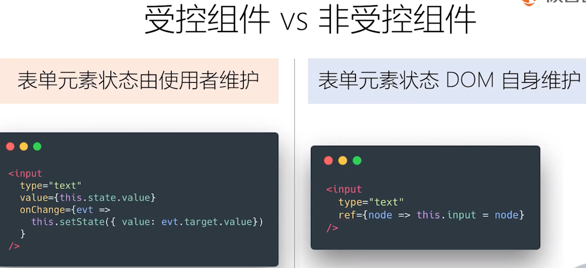
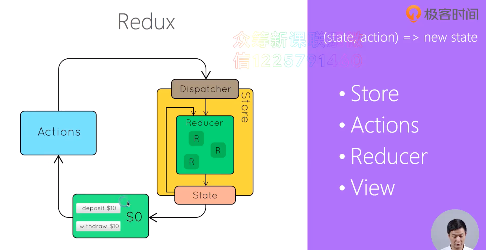
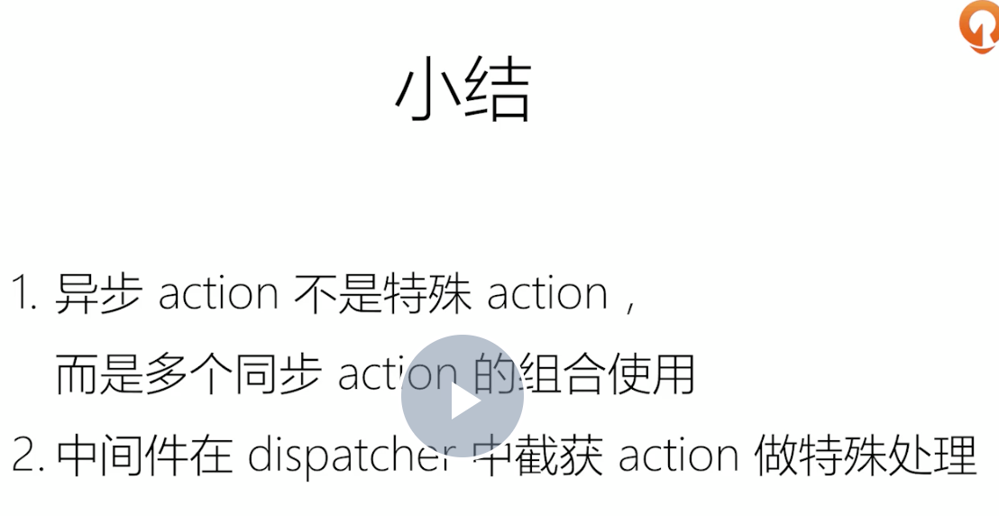
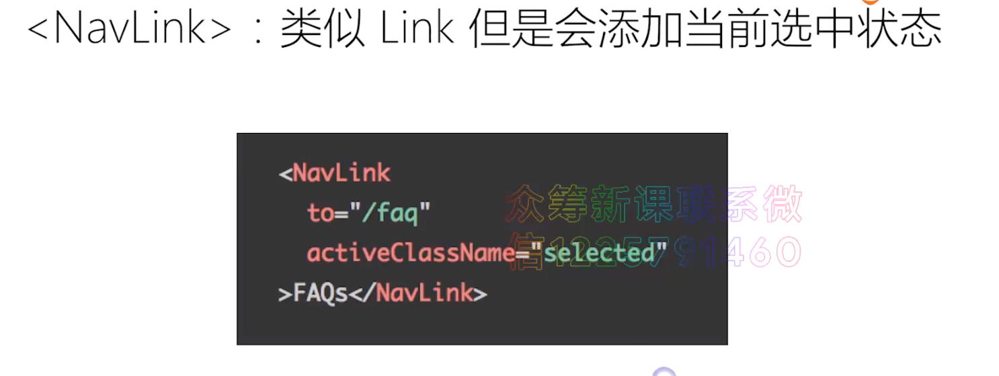
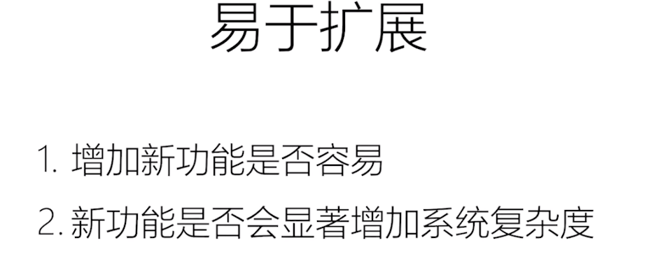
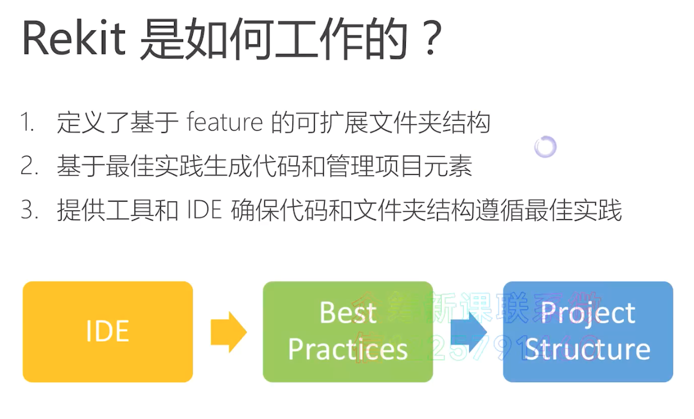

# 极客时间 
# **React出现的历史背景及特性介绍**

#  以组件方式考虑UI的构建

暴露事件让外部修改。

# JSX 的本质 - 不是模板引擎，而是语法糖

# **React组件的生命周期及其使用场景**

# **理解 Virtual DOM 及 key 属性的作用**

# ** 组件设计模式 - 高阶组件和函数作为子组件**

# **Context API 及其使用场景**

# **使用脚手架工具创建 React 项目**

线上 。

# **打包和部署**

访问路径。

# Redux

action 触发。

Reducer 处理action、更新state。

# **理解异步 Action，Redux 中间件**

# 如何组织Action和Reducer

# **理解不可变数据（Immutability）**

# **路由不只是页面切换，更是代码组织方式**

# **参数定义，嵌套路由的使用场景**

# ** UI组件库对比和介绍：Ant.Design，Material UI，Semantic UI**

# **使用Next.js创建React同构应用**

服务端渲染。

# **使用Jest，Enzyme等工具进行单元测试**

# **常用开发调试工具：ESLint，Prettier，React DevTool，Redux DevTool**

# **前端项目的理想架构：可维护，可扩展，可测试，易开发，易建构**

# **拆分复杂度（1）：按领域模型（feature）组织代码，降低耦合度**

# **拆分复杂度（2）：如何组织component，action和reducer**

# **拆分复杂度（3）：如何组织React Router的路由配置**

# **使用Rekit（1）：创建项目，代码生成和重构**

# ** 使用Rekit（2）：遵循最佳实践，保持代码一致性**

# **使用React Router管理登录和授权**

# **基于React Router实现分步操作**

# **集成第三方JS库：以 d3.js 为例**

# **基于路由实现菜单导航**

# **React 中拖放的实现**

[https://codesandbox.io/s/6n20nrzlxz?file=/src/c40/DndSample.js:0-2467](https://codesandbox.io/s/6n20nrzlxz?file=/src/c40/DndSample.js:0-2467)

# **性能永远是第一需求：时刻考虑性能问题**

# **使用Reselect避免重复计算**

