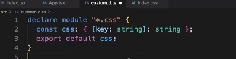
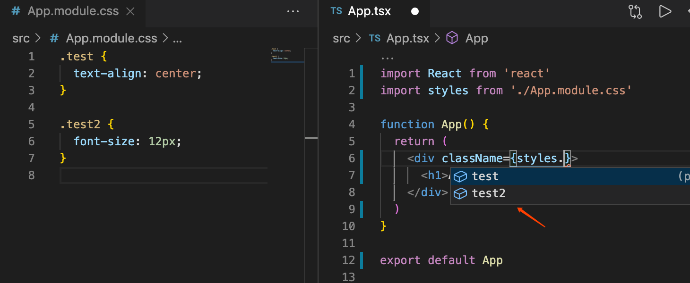
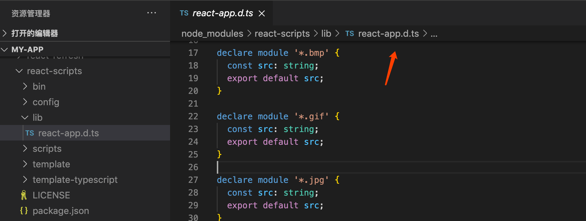
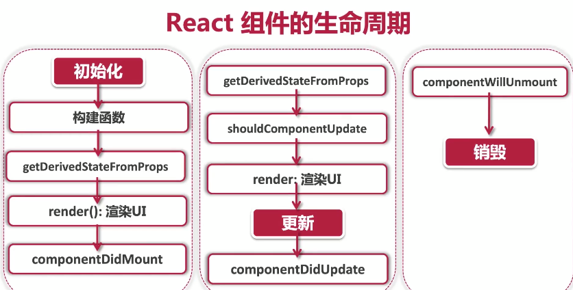
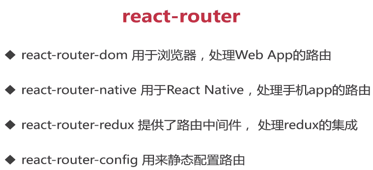
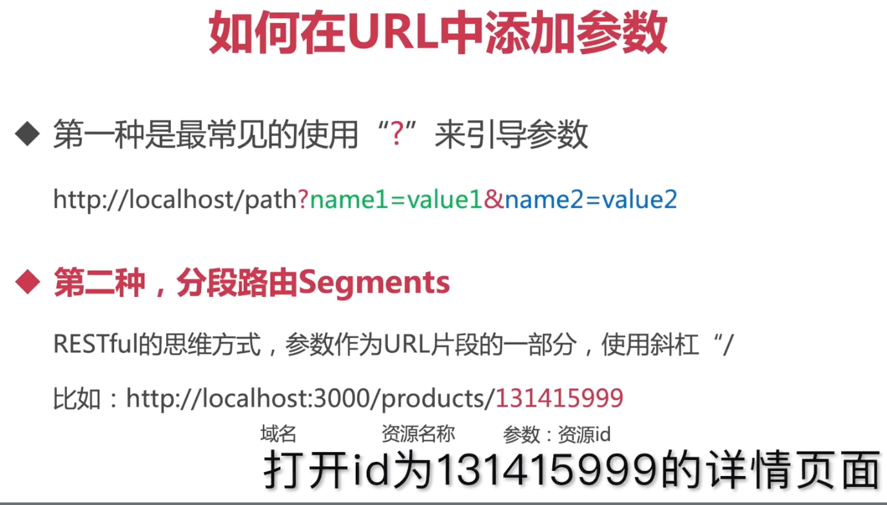
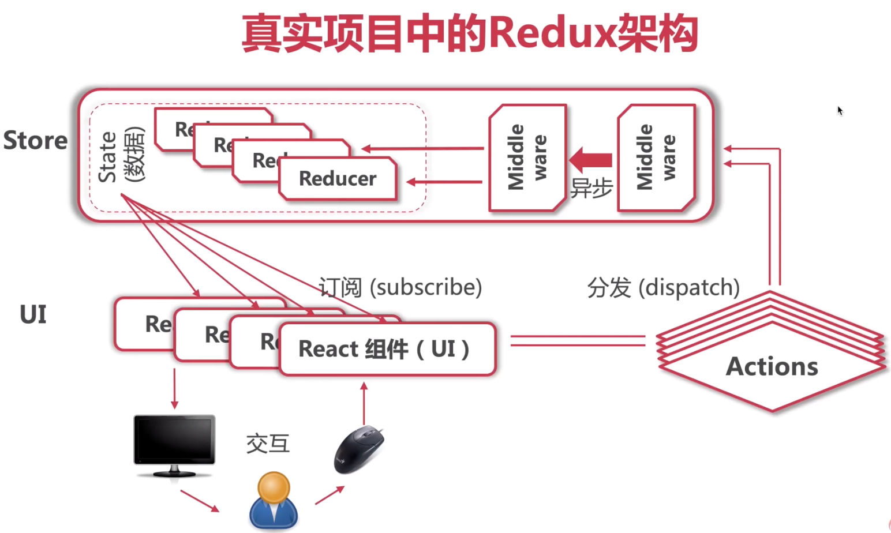
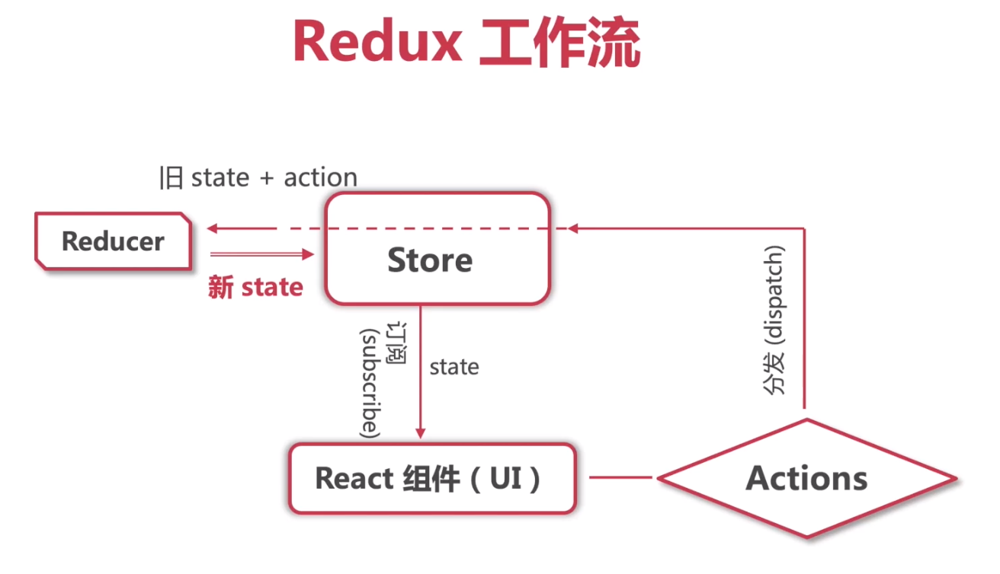
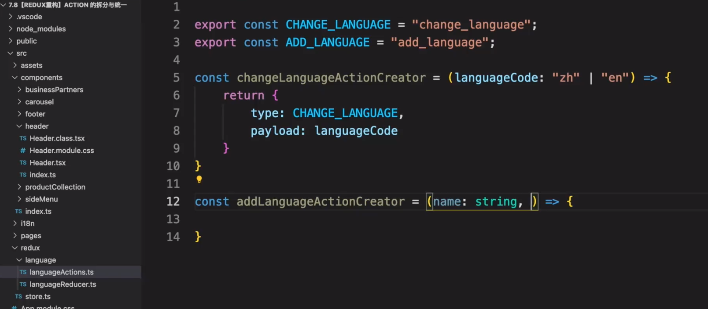

# react编程思想

## CSS in JS (JSS)

- 导入

```jsx
import styles from './App.module.css'
```

> 导入报错时，需要定义声明。




- 给CSS加上类型

```js
npm install typescript-plugin-css-modules --save-dev
```


> tscconfig.json

```json
    "plugins": [{"name": "typescript-plugin-css-modules"}]
```


> 配置TS SDK：项目根目录新建`.vscode/settings.json` 。

```json
{
  "typescript.tsdk": "node_modules/typescript/lib",
  "typescript.enablePromptUseWorkspaceTsdk": true
}
```


 现在编辑器对CSS 样式也有代码提示了。




- react 类型定义文件




## 事件驱动

e.target 事件发生的元素

e.currentTarget 事件处理绑定的元素

 

## 生命周期

Mounting：创建虚拟DOM，渲染UI

Updating：更新虚拟DOM，重新渲染UI

UNMounting：删除虚拟ODM，移除UI




# 系统设计

语言切换

# React路由框架

综合性路由框架：react-router



 

会自动安装react-router 核心框架。

<Link> 组件可以渲染出<a/>标签

<BrowserRouter/>组件利用H5API实现路由切换

<HashRouter/> 利用原生JS中的window.location.hash 来实现路由切换


浏览器路由框架：react-keeper

手机app框架（react-native)：react-navigation


## 如何在URL中添加参数




- 父组件


- 子组件

```ts
import {RouteComponentProps} from 'react-router-dom'


const Page:React.FC<RouteComponentProps> = (props) {}
```


## withRouter 与useRouter

- withRouter HOC 路由属性传递


- useRouter Hook

```shell
useHistory
useLocation
useParams
useRouteMatch
```


# redux







- 获取

store.getState()

- 订阅

store.subscribe(()=>{})


I18next 国际化

React-i18next 




## react-redux

[React Redux | React Redux (react-redux.js.org)](https://react-redux.js.org/)


Store 和 props 连接起来。7-9 7-10 

## 在类组件中使用7-9

```shell
npm i react-redux
npm i @types/react-redux --save-dev
```


##  在函数组件中使用


## 中间件

8-6 


