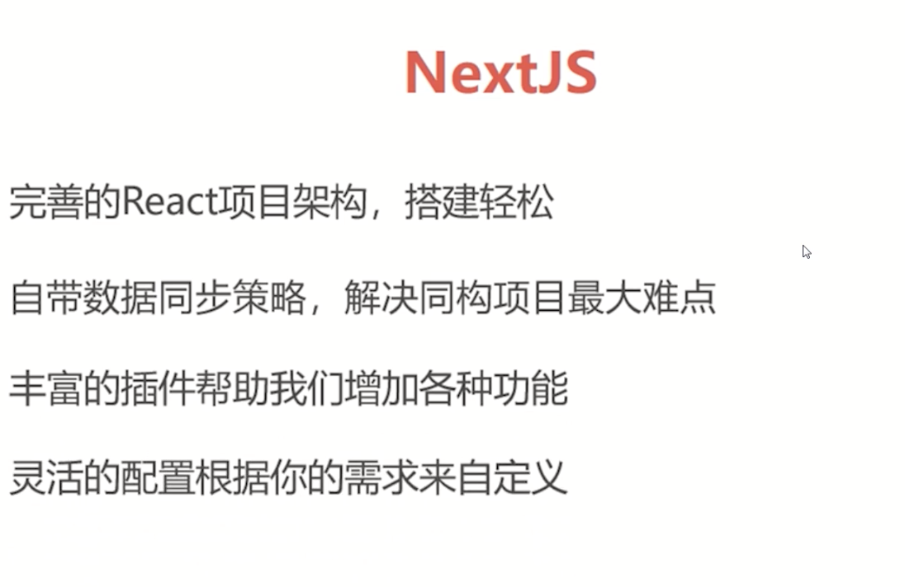
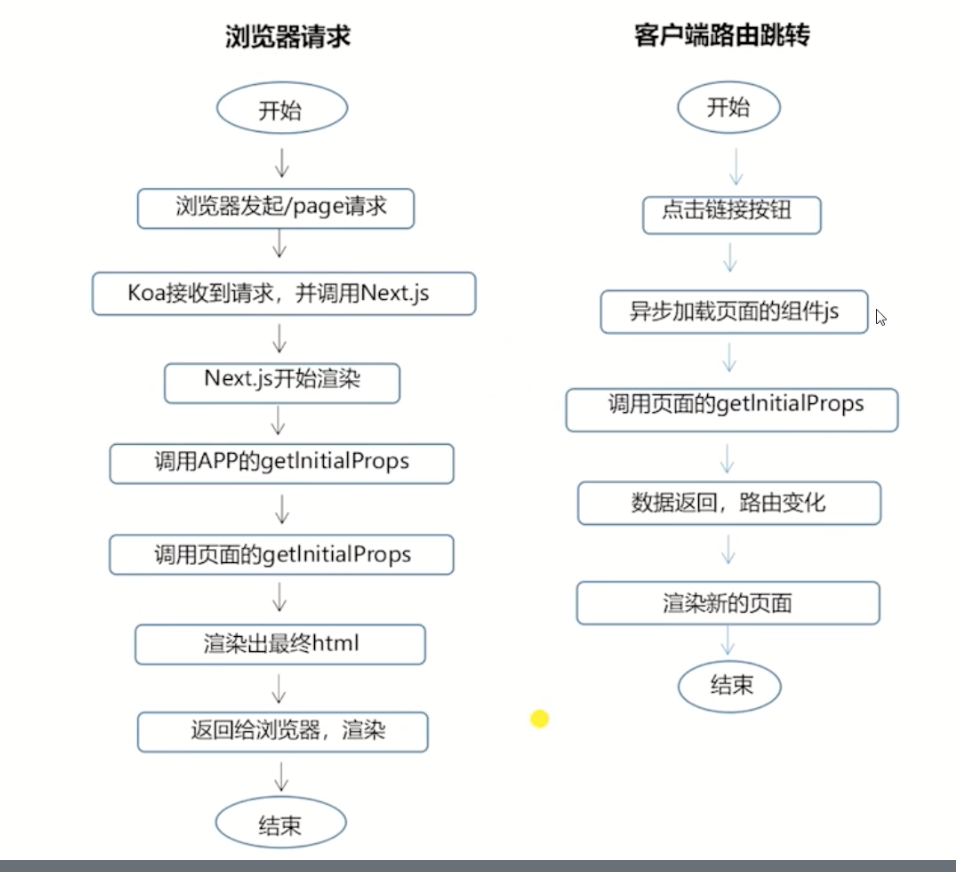
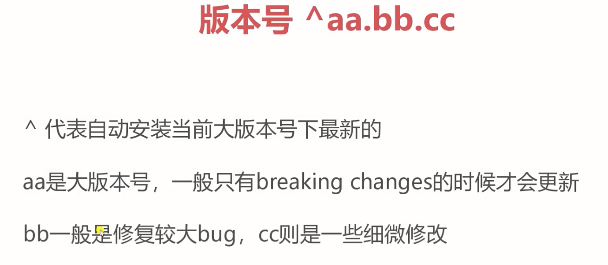
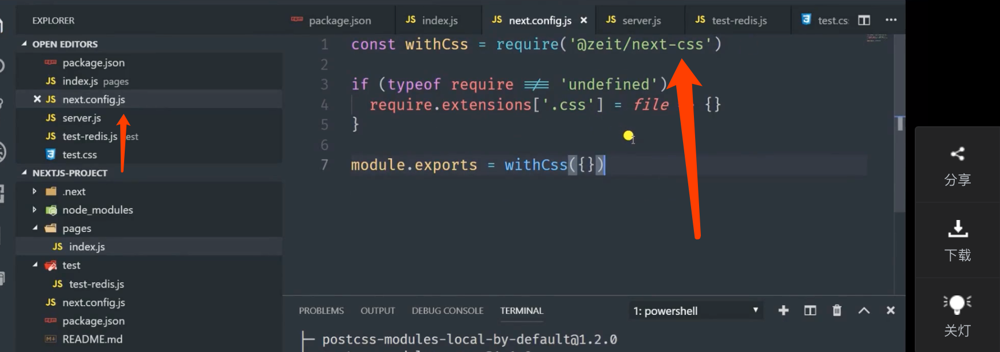

# github 实战 
# next

同构项目、服务端渲染。

nextjs

[https://nextjs.frontendx.cn/](https://nextjs.frontendx.cn/)

## 创建

- 手动创建

    yarn add react react-dom next

- 使用create-next-app

## **nextjs集成antd**

- next 默认不支持 css 的import。

    `yarn add @zeit/next-css`

