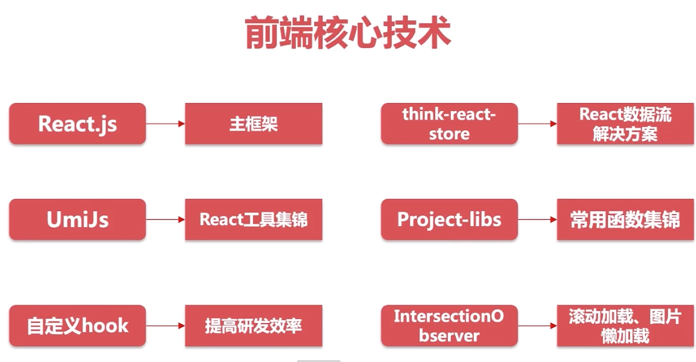
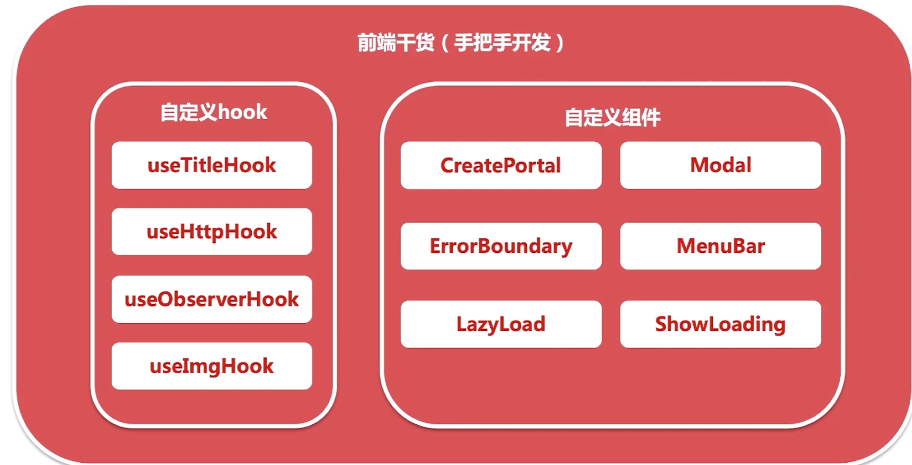
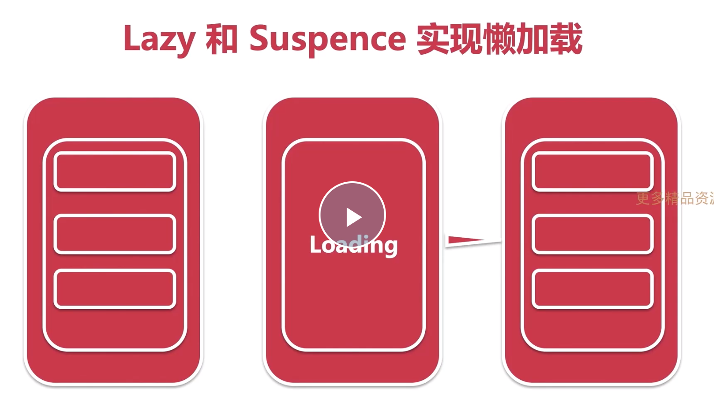
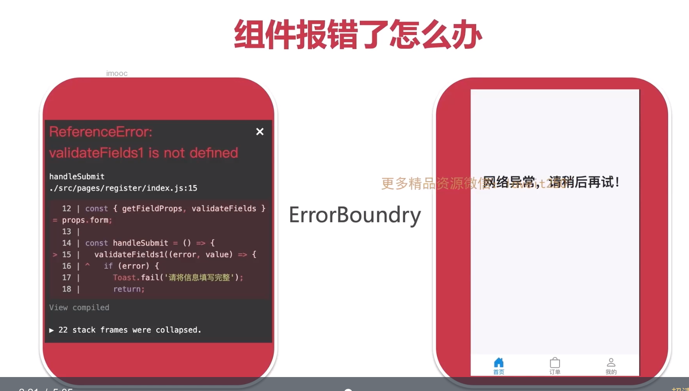
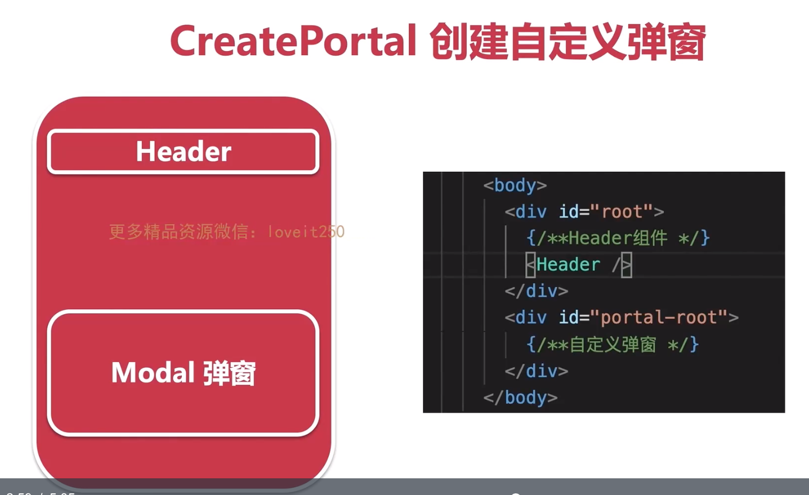
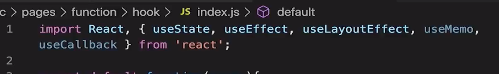
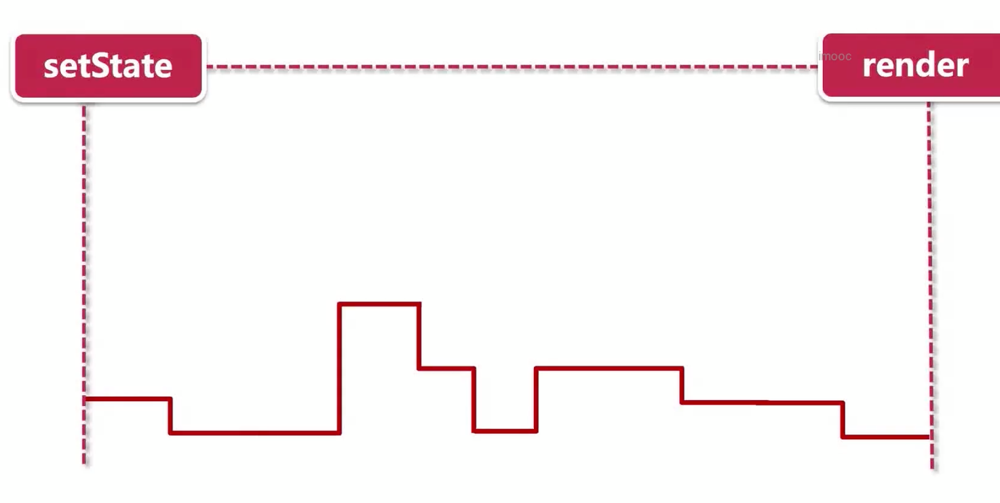
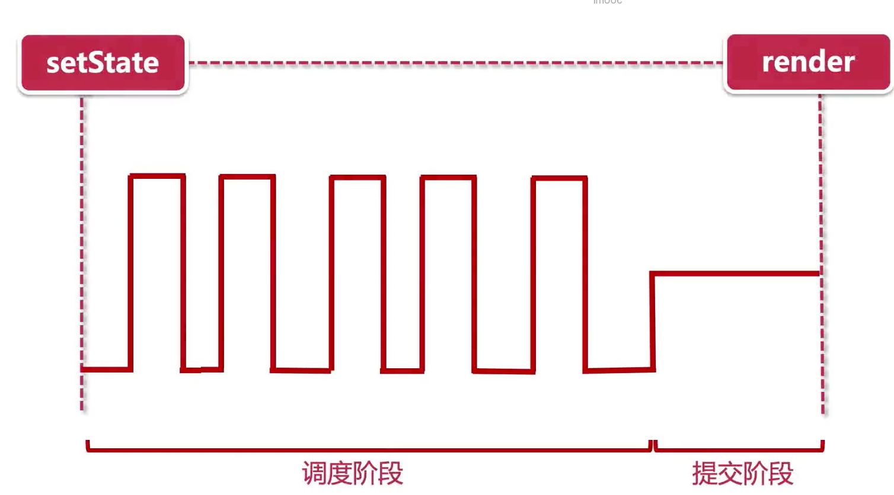
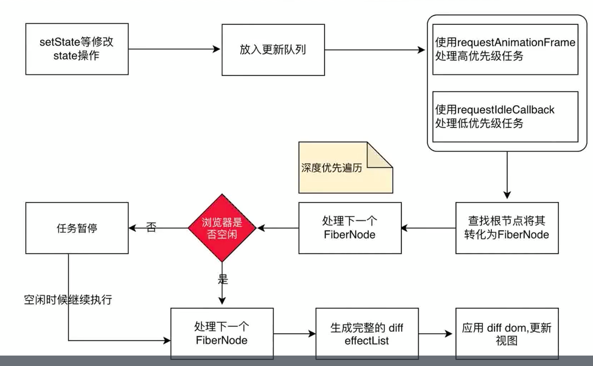
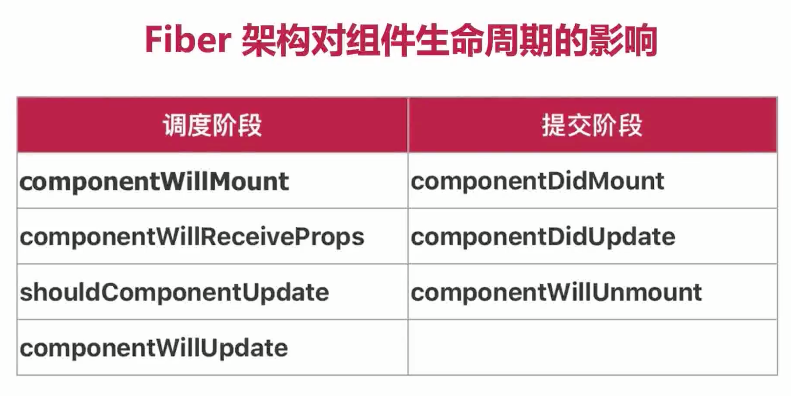

# umi 
# 2 

# UMI

# Hook

useEffect 不支持async await 。

# ** useContext和useReducer实现数据流管理**

# **使用think-react-store实现数据处理【基于React context 和 hook的数据流解决方案】**

# **Fiber架构解析**

-  16 版本之前的渲染流程

- filber

# react-icons

